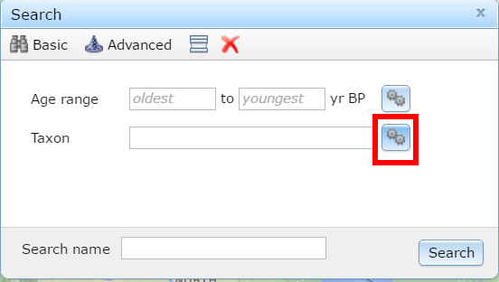

![Examples of Quaternary datasets, simplified and adapted from their original publications: (1) Species migration through time beginning 11,000 years before present (11ka), here, *Picea* (spruce) in Europe after the end of the last ice age [from Latalowa and van der Knaap, -@latalowa2006late]; (2) Megafaunal extinction interpreted from the decline in the fungal spore Sporormiella, present in the dung of large herbivores [after @gill2009pleistocene] and (3) change in mammal body size in the ground squirrel *Spermophilus beecheyi* [after @blois2008environmental].](figures/three_panel_rev.png)

).*](figures/Search_Site.png){ width=50% }

 show the initial stages of constructing chronologies for paleoecological records.](figures/R_withgithub.png){ width=50% }

{ width=50% }

![CCDRs involved in engagement can access new communities outside of the traditional sphere of activity in the research community, here various activities allow a database to engage with community experts (data stewards), data contributors, researchers accessing data, but also educators and individuals involved in outreach activities through platforms such as Flyover Country by providing well documented workflows for accessing and understanding the data within the database.  Clipart of the woman at a computer, created by Nikita Kozin and clip art of the database by Vicons Design, both from the Noun Project (http://nounproject.com), licensed under a CC-0 license.](figures/engagement_image_rev.png)
